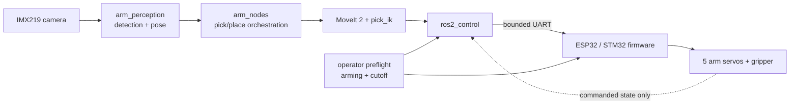

# Robot Arm — System Architecture

This document describes the active Robot Arm prototype, not the retired legacy
6-DOF simulation packages. The physical assembly is a **5-axis manipulator plus
a 1-DOF gripper**. Six PWM channels therefore do not imply six positioning
axes.

## Scope and evidence boundary

- Development host: Ubuntu 24.04, ROS 2 Jazzy.
- Active edge target: Raspberry Pi 5, ROS 2 Jazzy.
- Motion planning: MoveIt 2 with `pick_ik` for the accuracy-critical path.
- Low-level actuation: ESP32 or STM32 PWM firmware over bounded UART commands.
- Joint state on the physical prototype is open-loop commanded state; it is
  not encoder feedback.
- The project is a prototype and is not safety-certified for collaborative or
  industrial use.

Exact measured versions live in
[`docs/supported_versions.md`](docs/supported_versions.md). Recorded
limitations and physical evidence remain distinct from simulation results.

## Layered design

| Layer | Active implementation | Boundary |
| --- | --- | --- |
| Mechanical | `robot_arm_description` URDF/Xacro and meshes | 5 arm axes plus gripper |
| Power | External servo rail and operator-controlled cutoff | Not controlled or certified by ROS |
| Low-level control | ESP32/STM32 firmware, PWM mapping, watchdog | Commands servos; no encoder loop |
| Sensing | IMX219 camera and calibration artifacts | Camera measurements only |
| Communication | UART for motion; ROS 2/DDS for host data flow | Timeouts fail closed at the host/firmware boundary |
| High-level control | MoveIt 2, `arm_nodes`, `arm_bringup` | Plans and sequences motion |
| Perception | `arm_perception`, YOLO and planar pose estimation | Produces object observations, not safety-rated sensing |
| Safety | Arming gate, limits, timeout handling, operator preflight | Prototype safeguards, not a certified safety function |

## Active runtime flow



The real command chain is:

```text
MoveIt trajectory
  -> JointTrajectoryController
  -> arm_hardware::STM32SystemInterface
  -> framed UART command / acknowledgement
  -> firmware calibration and limit mapping
  -> servo PWM
```

The real hardware interface is implemented in
[`src/arm_hardware/src/stm32_system_interface.cpp`](src/arm_hardware/src/stm32_system_interface.cpp).
The absence of joint encoders and its effect on `/joint_states` are documented
in [`docs/real_control_chain_audit.md`](docs/real_control_chain_audit.md).

## Active ROS 2 packages

| Package | Responsibility |
| --- | --- |
| `arm_interfaces` | Project messages, services and actions |
| `robot_arm_description` | Physical robot model, calibration and controller configuration |
| `robot_arm_moveit_config` | MoveIt 2 planning configuration for the Robot Arm |
| `arm_hardware` | `ros2_control` UART hardware interface |
| `arm_nodes` | Pick/place orchestration and measurement tools |
| `arm_perception` | Camera, calibration, detection and operator console |
| `arm_bringup` | Simulation and real-hardware launch orchestration |
| `arm_tests` | Unit, integration and benchmark surfaces |

The earlier `arm_description`, `arm_gazebo`, `arm_kinematics`, `arm_ml` and
`arm_moveit_config` packages are retained as documented experiments and marked
with `COLCON_IGNORE`. They are not active dependencies. Their status and
re-enablement conditions are recorded in [`src/README.md`](src/README.md) and
[`src/LEGACY_6DOF.md`](src/LEGACY_6DOF.md).

## Simulation boundary

Simulation uses Gazebo Harmonic and must be started through:

```bash
./start_simulation.sh --basic
```

The launcher prevents overlapping simulator instances and performs controlled
cleanup. A successful action result or log line is not physical evidence; pose
state and the rendered scene must agree. Simulation does not exercise the
physical power rail, UART timing, servo calibration, backlash, or open-loop
position error.

## Real-hardware boundary

The canonical control-plane entry point is `./start_robot.sh`. It starts
DISARMED and requires `ROBOT_ARM_HOST` to be supplied explicitly. Arming and
servo power remain separate operator-controlled steps.

Important constraints:

- Servo rail OFF and arm mechanically supported during preflight.
- Firmware version and calibration fingerprint must match expectations.
- Communication timeout and E-stop latch require explicit re-arming.
- A ROS success response is not proof that a physical joint reached position.
- Physical limits come from measured calibration artifacts, not guessed URDF
  values.

## Verification surfaces

```bash
# Static repository checks
./scripts/verify_workspace.sh --quick

# Clean ROS package build/tests and native firmware tests
./scripts/verify_workspace.sh --full
```

Hardware motion, camera accuracy and grasp acceptance require their dedicated
operator-controlled procedures and cannot be replaced by CI.
