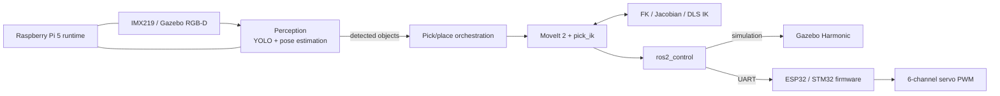

# Robot Arm — ROS 2, Vision and Embedded Control

[](https://github.com/eemreinceer/Robot_Arm/actions/workflows/repository-baseline.yml)

An end-to-end robotics integration project spanning ROS 2, MoveIt 2, Gazebo
Harmonic, computer vision, calibration, `ros2_control`, Raspberry Pi 5 and
ESP32/STM32 firmware.

The repository records both working results and failed hypotheses. A green
build, a successful action response and physical robot acceptance are treated
as different evidence classes.

> **Hardware scope:** the project name follows the six-servo assembly. The
> current physical model is a **5-axis manipulator plus a 1-DOF gripper**.
> This repository documents software, integration and recorded measurements;
> it does not claim ownership of the physical hardware used to produce them.

## What this project demonstrates

- ROS 2 package and interface design across planning, control, perception and
  deployment layers.
- MoveIt 2 motion planning and a measured comparison of `pick_ik`, custom DLS
  IK and a PyTorch IK seed model.
- Gazebo simulation, synthetic perception data and YOLO-based object detection.
- Camera intrinsics, planar pose and hand-eye calibration workflows with
  machine-readable evidence.
- A `ros2_control` hardware interface over bounded UART transactions.
- ESP32/STM32 PWM firmware with watchdog, calibration fingerprint and native
  protocol tests.
- Raspberry Pi 5 camera/runtime deployment with systemd recovery behavior.
- Fail-closed verification, issue-driven debugging and explicit safety limits.

## System architecture



The layers are deliberately separated: mechanical description, power and
actuation, low-level control, sensing, communication, high-level planning,
perception and safety. Simulation and real-hardware launch/configuration paths
remain distinct.

## Selected measured evidence

These are recorded project measurements, not production guarantees.

| Area | Recorded result | Engineering decision / evidence |
| --- | --- | --- |
| IK comparison | On 500 FK-generated reachable targets with a 5 mm gate: `pick_ik` 100%, custom DLS 27.6%, DL IK 2.2% accurate | Precision path stays with `pick_ik`; the fast DL model is research/seed work, not a final solver. [Report](src/arm_tests/benchmark_results/ik_comparison_report.md) |
| Legacy IK benchmark | Custom IK returned success on 1,000 samples at 1.48 ms average | Preserved as an earlier experiment, not substituted for the newer accuracy-gated result. [Report](src/arm_tests/benchmark_results/kinematics_report.md) |
| Edge inference | YOLOv8n TensorRT FP16: 46.14 ms mean GPU compute on Jetson Nano | End-to-end PT → ONNX → TensorRT deployment path passed. [Report](reports/nano_e2b_tensorrt.md) |
| Camera calibration | Free principal-point policy: 0.1254 px validation reprojection; provenance gap remains documented | Lower variance was rejected when it introduced a larger pose bias. [Analysis](docs/calibration_principal_point_policy.md) |
| MCU fault visibility | Host silence detected after 32.1 ms; watchdog `E3` response observed after 7.6 ms in the recorded fault test | Timeout visibility is measured separately from actuator-safe-state policy. [Evidence](docs/watchdog_policy_proposal.md) |
| CI baseline | Static checks, clean ROS 2 Jazzy build/tests, native STM32/ESP32 tests, and web-console build/audit | Current workflow: [repository-baseline.yml](.github/workflows/repository-baseline.yml) |

## Design choices and trade-offs

- **Accuracy before attractive metrics:** a solver returning a joint vector is
  not counted as accurate unless FK reconstruction passes the stated gate.
- **Command is not feedback:** the current real arm has no joint encoders.
  `/joint_states` can represent commanded/open-loop state and must not be
  presented as measured servo position. See the
  [real control-chain audit](docs/real_control_chain_audit.md).
- **Simulation is not physical acceptance:** Gazebo logs alone do not prove a
  stable grasp or placement. A documented false-positive sorting result is
  retained in the [honest status report](reports/honest_status_grasp_reality_0606.md).
- **Calibration metrics need context:** reprojection error can remain nearly
  unchanged while pose bias grows. The repository keeps datasets, manifests,
  policies and rejected interpretations together.
- **Watchdog behavior is a system decision:** holding torque, relaxing an arm
  and reporting a fault have different mechanical risks; firmware timeouts are
  not treated as a complete safety system.

## Five-minute technical review

1. Start with the [architecture](ARCHITECTURE.md) and
   [supported version matrix](docs/supported_versions.md).
2. Inspect the real command path in
   [`stm32_system_interface.cpp`](src/arm_hardware/src/stm32_system_interface.cpp)
   and its [tests](src/arm_hardware/test/).
3. Review the perception path in
   [`arm_perception`](src/arm_perception/arm_perception/) and the
   [calibration policy](docs/calibration_principal_point_policy.md).
4. Compare IK approaches using the
   [accuracy-gated benchmark](src/arm_tests/benchmark_results/ik_comparison_report.md).
5. Check the [CI workflow](.github/workflows/repository-baseline.yml),
   [acceptance reports](reports/) and [current limits](#current-limits).

## Repository map

| Path | Responsibility |
| --- | --- |
| [`src/arm_nodes/`](src/arm_nodes/) | Pick/place orchestration and analysis tools |
| [`src/arm_perception/`](src/arm_perception/) | Camera, YOLO, calibration and operator console |
| [`src/arm_hardware/`](src/arm_hardware/) | `ros2_control` UART hardware interface |
| [Robot description package](src/robot_arm_description/) | Robot model, calibration and control configuration |
| [`firmware/`](firmware/) | ESP32 and STM32 servo firmware |
| [`deploy/pi5/`](deploy/pi5/) | Active Raspberry Pi 5 deployment surface |
| [`data/`](data/), [`runs/`](runs/), [`reports/`](reports/) | Measurements, run artifacts and engineering conclusions |
| [`scripts/`](scripts/) | Verification, calibration and diagnostic tools |

The active and legacy ROS 2 packages are indexed in [`src/README.md`](src/README.md).
Legacy IK, ML and Gazebo experiments remain reviewable but are excluded from
the default workspace build.

## Verify locally

Development baseline: Ubuntu 24.04 and ROS 2 Jazzy. Exact target versions are
listed in [`docs/supported_versions.md`](docs/supported_versions.md).

```bash
# Static repository and documentation checks
./scripts/verify_workspace.sh --quick

# Clean active-workspace ROS build/tests plus native firmware checks;
# no physical robot, UART or Gazebo startup
./scripts/verify_workspace.sh --full

# Operator-console build and dependency audit
(
  cd src/arm_perception/web/robot-arm-console
  npm ci && npm run build && npm audit --audit-level=high
)

# Simulation must use the canonical launcher and be stopped after the run
./start_simulation.sh --basic
```

Hardware, servo power, firmware flashing and robot motion require the relevant
preflight and operator-controlled procedure. See
[`CONTRIBUTING.md`](CONTRIBUTING.md) before reproducing those steps.

## Current limits

- This is a prototype and engineering portfolio, not a production or
  safety-certified robot.
- The current physical chain is open-loop at the joints; encoder-based
  closed-loop verification remains future work.
- Some historical experiments target Jetson Nano; Raspberry Pi 5 is the active
  runtime target.
- Physical hardware is not available for every reproduction step.
- Trained model weights are not distributed; local provisioning and provenance
  requirements are documented under each package's `models/` directory.
- A successful simulation or mock test does not imply a successful physical
  grasp, calibrated accuracy or human-safe operation.

## AI-assisted workflow disclosure

AI tools assisted parts of implementation, review and documentation. The
engineering value claimed here is system decomposition, measurement design,
integration, verification and explicit treatment of uncertainty—not that every
line was written without assistance. Technical claims in this repository are
therefore linked to code, tests, measurements or explicit limitations instead
of being justified by authorship alone.

## License

Copyright (c) 2026 Emre Inceer. This repository is available for portfolio
review and technical evaluation; reuse and redistribution are not granted.
See [`LICENSE`](LICENSE). Identified third-party components remain subject to
their own terms. Files under `src/arm_hardware/` carrying an Apache-2.0 notice
retain that file-specific license.

Security reports and disclosure expectations are documented in
[`SECURITY.md`](SECURITY.md).

Project owner: [Emre Inceer](https://github.com/eemreinceer)
